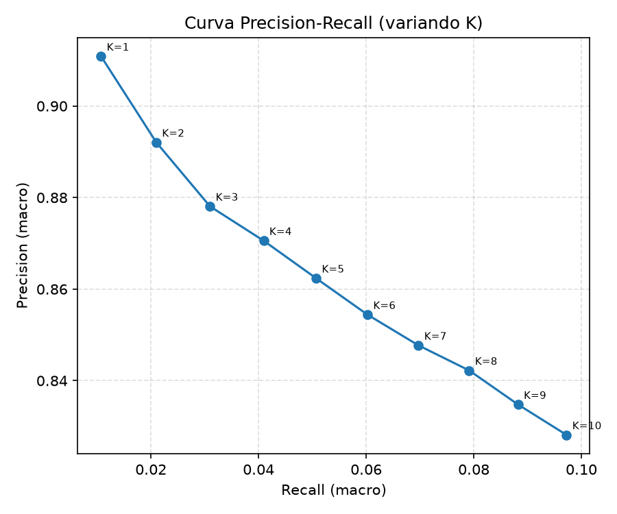
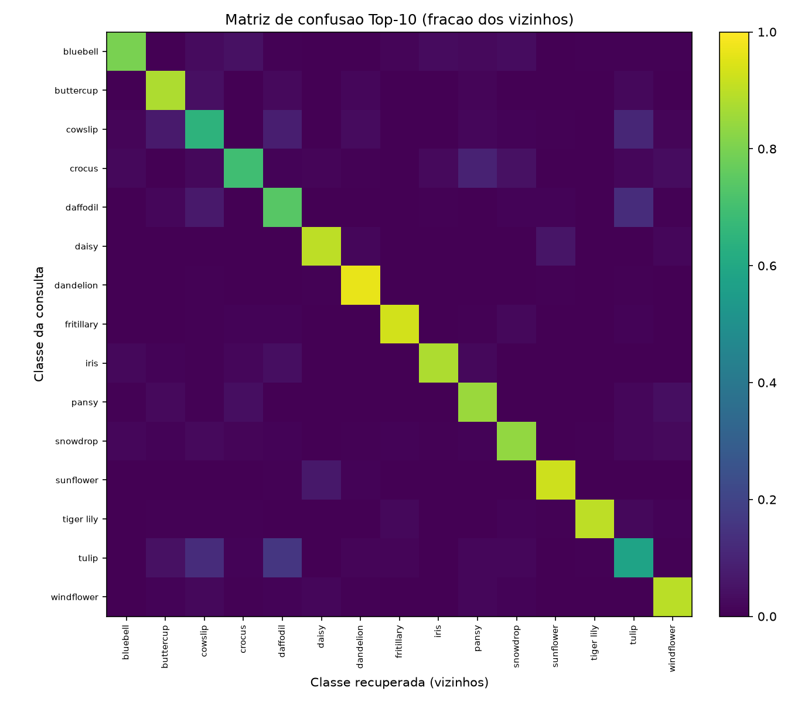
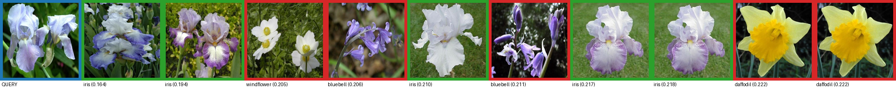
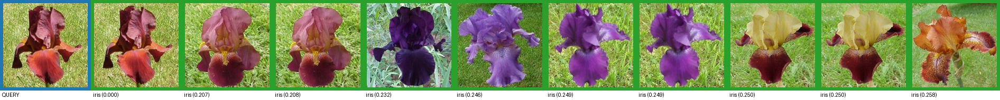
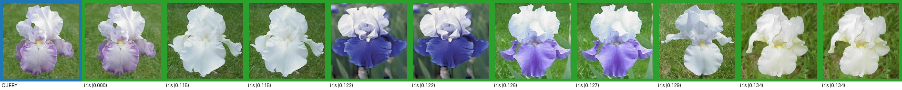

# Issue 5 - Validacao de casos criticos e avaliacao de desempenho

- Data da execucao: 2026-08-05 00:03:59
- Metrica de recuperacao: `cosseno` (operador `<=>`)
- K maximo avaliado: `10`
- Total de imagens (consultas): `1360`
- Classes criticas investigadas: `iris`

> Observacao: o dataset Oxford Flower 17 possui uma unica classe `iris`. As
> especies **Bearded Iris** e **Douglas Iris** citadas no artigo base vem de um
> dataset de iris mais granular. Aqui a classe `iris` e tratada como caso critico;
> use `--critical-classes` se um dataset com essas especies for carregado.

## 1. Precision e Recall gerais

| K | Precision (macro) | Recall (macro) | Precision (micro) | Recall (micro) |
|---|-------------------|----------------|-------------------|----------------|
| 5 | 0.862 | 0.051 | 0.870 | 0.048 |
| 10 | 0.828 | 0.097 | 0.837 | 0.092 |

## 2. Curva Precision-Recall

## 3. Matriz de confusao adaptada para Top-K

Matriz normalizada por linha em Top-10 (fracao dos vizinhos recuperados por classe).

## 4. Casos criticos e falsos positivos

### Classe critica: `iris` (Top-10)

- Precision media: `0.875`
- Recall medio: `0.111`
- Vizinhos analisados: `800`
- Falsos positivos: `100`

Classes que mais aparecem como falso positivo:

| Classe confundida | Ocorrencias |
|-------------------|-------------|
| daffodil | 31 |
| bluebell | 18 |
| pansy | 18 |
| crocus | 14 |
| buttercup | 8 |
| cowslip | 4 |
| windflower | 3 |
| tiger lily | 1 |
| tulip | 1 |
| fritillary | 1 |
| snowdrop | 1 |

## 5. Exemplos visuais (query + vizinhos)

Borda azul = consulta, verde = acerto (mesma classe), vermelha = falso positivo.

## 6. Consolidacao para Resultados e Discussao

- Tabela da secao 1 resume Precision/Recall gerais.
- A curva PR (secao 2) mostra o trade-off ao aumentar K.
- A matriz de confusao (secao 3) indica com quais classes a busca confunde cada consulta.
- A secao 4 detalha os falsos positivos das classes criticas.
- As imagens da secao 5 servem de figura direta para o relatorio.
